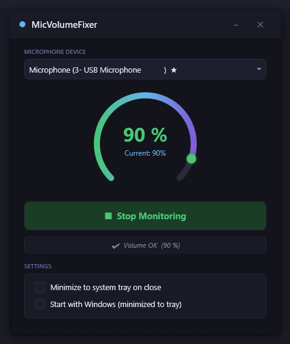

# MicVolumeFixer

A Windows system tray application that monitors your microphone volume and automatically corrects it to a target level. Prevents unwanted volume changes caused by apps like Discord, Zoom, or Windows itself.

## Features

- **Automatic volume correction** — checks every second and resets mic volume to your target
- **Device selection** — pick any active microphone, default device marked with ★
- **System tray** — minimizes to tray with balloon notification, double-click to restore
- **Start with Windows** — optional autostart in tray mode (`--tray` flag)
- **Dark themed UI** — modern dark interface built with WPF
- **Persistent settings** — target volume, device selection, and preferences saved to a local `settings.json`

## Screenshot



## Requirements

- Windows 10 or later
- [.NET 10 Runtime](https://dotnet.microsoft.com/download/dotnet/10.0) (or SDK to build from source)

## Build

```bash
dotnet build
```

## Run

```bash
dotnet run
```

Or launch the compiled `MicVolumeFixer.exe` directly.

### Command-line flags

| Flag | Description |
|------|-------------|
| `--tray` | Start minimized to system tray |

## How it works

1. Select your microphone from the dropdown
2. Set your desired volume with the slider
3. Click **Start Monitoring**
4. The app checks the mic volume every second and corrects it if anything changes it

## Settings

Settings are stored in `settings.json` next to the executable:

- **TargetVolume** — desired mic level (0-100)
- **MonitoringActive** — whether monitoring was running when the app last closed
- **MinimizeToTray** — minimize to tray instead of closing
- **SelectedDeviceId** — previously selected microphone

The "Start with Windows" option writes to the Windows Registry (`HKCU\...\Run`) to register the app for startup.

## Tech stack

- **WPF** (.NET 10)
- **NAudio** — Windows Core Audio API (WASAPI) wrapper
- **H.NotifyIcon.Wpf** — WPF system tray integration

## License

[MIT](LICENSE)

## Credits

- Microphone icon by [Freepik](https://www.freepik.com/icon/microphone_2618189)
